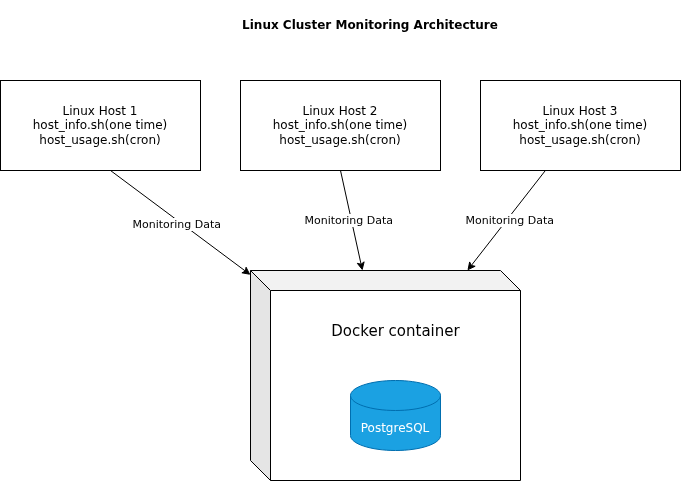

# Linux Cluster Monitoring Agent

## Introduction
The Linux Cluster Monitoring Agent project develops a monitoring solution for the Linux Cluster Administration (LCA) team to track system performance across multiple Linux servers. The system collects both hardware specifications and real-time resource usage data from each node in the cluster and stores the information in a centralized PostgreSQL database.

The solution is designed for the LCA team to monitor CPU, memory, and disk usage across servers and support resource planning decisions such as scaling infrastructure. The system uses Bash scripts as monitoring agents, Docker to manage the database environment, and cron jobs to automate data collection. This project demonstrates practical skills in Linux scripting, database design, and system monitoring in a clustered environment.
 
# Quick Start

```bash
# 1. Create PostgreSQL container
./scripts/psql_docker.sh create postgres password

# 2. Start PostgreSQL container
./scripts/psql_docker.sh start

# 3. Create database tables
psql -h localhost -U postgres -d host_agent -f sql/ddl.sql

# 4. Insert hardware information
./scripts/host_info.sh localhost 5432 host_agent postgres password

# 5. Insert usage data
./scripts/host_usage.sh localhost 5432 host_agent postgres password

# 6. Setup cron job (run every minute)
crontab -e
* * * * * bash /home/rocky/dev/jarvis_data_eng_JiahuiYang/linux_sql/scripts/host_usage.sh localhost 5432 host_agent postgres password
```

# Implementation

This project implements monitoring system that collects system-level data from multiple Linux hosts and stores it in a centralized PostgreSQL database. The solution is designed to be simple, modular, and easy to deploy using Bash scripts and Docker.

## Architecture

The system follows a centralized architecture where multiple Linux nodes send monitoring data to a single database instance.

- Three Linux hosts simulate a cluster environment  
- Each host runs a Bash-based monitoring agent  
- The agent collects both static and dynamic system data  
- A centralized PostgreSQL database stores all collected data  
- Docker is used to provision and manage the database instance  

Each monitoring agent consists of two scripts:

- `host_info.sh`: collects hardware specifications (CPU, memory, etc.) and runs once during setup  
- `host_usage.sh`: collects real-time resource usage (CPU, memory, disk) and runs periodically using cron  

This design separates one-time data collection from continuous monitoring, improving efficiency and reducing redundant operations.

<p align="center">
  
</p>

## Scripts

### `psql_docker.sh`
Manages the PostgreSQL Docker container lifecycle (create, start, stop).

```bash
# Create a PostgreSQL container
./scripts/psql_docker.sh create postgres password

# Start the container
./scripts/psql_docker.sh start

# Stop the container
./scripts/psql_docker.sh stop
```

### `host_info.sh`
Collects static hardware information (CPU, memory, etc.) from the host and inserts it into the `host_info` table.  
This script is executed **once** during setup.

```bash
./scripts/host_info.sh localhost 5432 host_agent postgres password
```

### `host_usage.sh`
Collects real-time system usage metrics (CPU, memory, disk, etc.) and inserts them into the `host_usage` table.  
This script runs **periodically using cron**.

```bash
./scripts/host_usage.sh localhost 5432 host_agent postgres password
```

### `crontab`
Schedules the `host_usage.sh` script to run every minute.

```bash
# Edit crontab
crontab -e

# Run every minute
* * * * * bash /path/to/host_usage.sh localhost 5432 host_agent postgres password
```

### `ddl.sql`
Contains SQL statements to create the required tables for the monitoring system.

It defines:
- `host_info`: stores static hardware information  
- `host_usage`: stores real-time system metrics  

```bash
# Run DDL script to create tables
psql -h localhost -U postgres -d host_agent -f sql/ddl.sql
```

## Database Modeling

The system uses a relational database with two tables: `host_info` and `host_usage`.

### `host_info`
Stores static hardware information for each Linux host.

| Column            | Type               | Description                          |
|------------------|--------------------|--------------------------------------|
| id               | SERIAL             | Primary key                          |
| hostname         | VARCHAR            | Unique host name                     |
| cpu_number       | INT                | Number of CPUs                       |
| cpu_architecture | VARCHAR            | CPU architecture                     |
| cpu_model        | VARCHAR            | CPU model                            |
| cpu_mhz          | DOUBLE PRECISION   | CPU speed                            |
| l2_cache         | INT                | L2 cache size                        |
| timestamp        | TIMESTAMP          | Data collection time                 |
| total_mem        | INT                | Total memory                         |


### `host_usage`
Stores real-time system usage metrics collected periodically.

| Column          | Type       | Description                          |
|-----------------|------------|--------------------------------------|
| timestamp       | TIMESTAMP  | Data collection time                 |
| host_id         | INT        | Foreign key referencing host_info    |
| memory_free     | INT        | Free memory                          |
| cpu_idle        | INT        | CPU idle percentage                  |
| cpu_kernel      | INT        | CPU kernel usage                     |
| disk_io         | INT        | Disk I/O operations                  |
| disk_available  | INT        | Available disk space                 |


### Relationship

- One `host_info` record represents one host  
- One host can have multiple `host_usage` records  
- `host_usage.host_id` --->  `host_info.id` (Foreign Key)

# Test

#### `ddl.sql`
- Executed against a running PostgreSQL container to ensure the tables were created successfully.

```bash
psql -h localhost -U postgres -d host_agent -f sql/ddl.sql
```

**Verification:**
```bash
# List tables
\dt

# Describe tables
\d host_info
\d host_usage
```

**Result:**
- Both `host_info` and `host_usage` tables were created successfully
- Table schemas match the expected design
- Constraints (primary key and foreign key) were correctly applied

#### `host_info.sh`
- Executed the script to insert static hardware data

```bash
./scripts/host_info.sh localhost 5432 host_agent postgres password
```

**Result:**
- One record successfully inserted into `host_info`
- Data correctly reflects system hardware information


#### `host_usage.sh`
- Executed the script manually and via cron

```bash
./scripts/host_usage.sh localhost 5432 host_agent postgres password
```

**Verification:**
```bash
SELECT * FROM host_usage;
```

**Result:**
- Multiple records inserted into `host_usage`
- Data updated every minute when scheduled with cron
- Values (CPU, memory, disk) reflect real-time system usage

### Overall Result

All scripts and database components were tested successfully.  
The system is able to:
- Create required tables  
- Insert static host information  
- Continuously collect and store usage metrics

# Deployment

The application was deployed using Docker, GitHub, and cron.
PostgreSQL was run in a Docker container using `psql_docker.sh`.  
Database tables were created using `ddl.sql`, and data was inserted using `host_info.sh` and `host_usage.sh`.
The project code is managed in GitHub under the `linux_sql` directory.
To automate data collection, a cron job was configured to run `host_usage.sh` every minute.This setup allows the system to run continuously and be easily deployed on any Linux machine.

# Improvements

- Improve error handling and logging in bash scripts for better debugging and reliability  
- Optimize data collection frequency to reduce system overhead and database load  
- Add data visualization (e.g., dashboards) for better monitoring and analysis  
- Implement alerting to notify when system metrics exceed thresholds  

