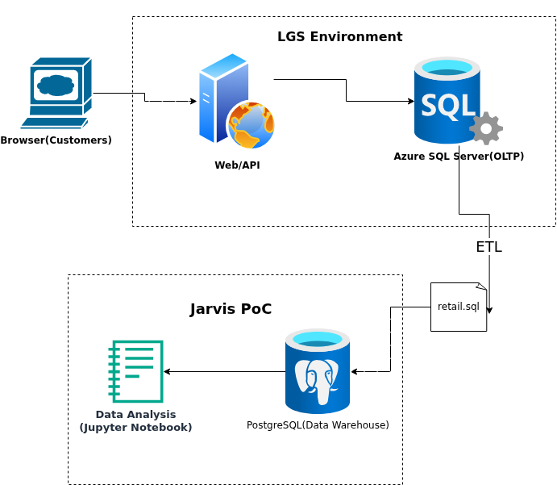

# Introduction
London Gift Shop (LGS) is an online giftware retailer based in the UK. Although the company has operated its online store for many years, its revenue growth has slowed down recently.To improve sales performance, LGS wants to better understand customer shopping behaviour, especially because many of its customers are wholesalers who may have different purchasing patterns compared with regular retail customers.

In this PoC project, I analyzed transaction data stored in a PostgreSQL data warehouse using Jupyter Notebook and several Python analysis libraries, such as Pandas, Matplotlib .The notebook connects to the database, and the analysis focuses on uncovering patterns in customer purchases to support data-driven marketing decisions.

# Implementaion
## Project Architecture
- **LGS Web App & OLTP System**
  - Customers place orders through the web app
  - Transaction data is stored in Azure SQL Server (OLTP)
- **Data Extraction & Warehouse**
  - Data is exported into `retail.sql` and loaded into PostgreSQL (Docker)
  - PostgreSQL acts as a simple OLAP data warehouse
- **Data Analysis**
  - Jupyter Notebook connects to PostgreSQL
  - Analyzes the data using Python(Pandas, Matplotlib)

- **Business insights**
    - Generate insights on customer behavior
    - Support targeted marketing and growth strategies

  

## Data Analytics and Wrangling
- Jupyter Notebook: [Retail Data Analytics](./retail_data_analytics_wrangling.ipynb)
- Use **Recency, Frequency, Monetary (RFM)** metrics to calculate customer value and segment customers into groups such as *Champions, Loyal Customers, At Risk, and Hibernating*
- Focus on **high-value customers** (recent, frequent, high spend) with loyalty programs and targeted promotions to maximize revenue
- Analyze **monthly sales trends and growth rates** to identify peak periods and optimize marketing timing
- Track **active customers over time** to understand engagement patterns and overall business performance
- Compare **new vs existing customers** to evaluate customer acquisition and retention, and adjust marketing strategies accordingly

# Improvements
- Improve data quality by checking missing values and inconsistent records before performing analysis  
- Include more details such as product categories or country to better understand customer preferences and improve segmentation
- Automate the data process (data loading and analysis) so results can be updated regularly instead of running the notebook manually  