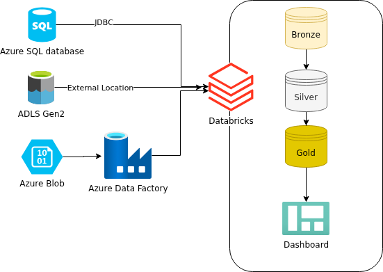
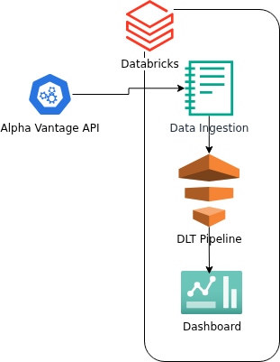
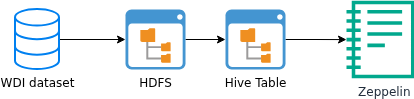

# Introduction
Traditional data analytics solutions built with Python and Jupyter Notebooks are limited by the resources of a single 
machine and may struggle to efficiently process large datasets. To address this challenge, this project evaluates Apache Spark as a distributed computing framework capable of performing large-scale data processing across a cluster environment.

The project explores two Spark-based platforms: Zeppelin running on Hadoop and Databricks running on Azure. In the Zeppelin implementation, I analyzed the WDI dataset using Hadoop HDFS, Hive, Zeppelin, and PySpark. In the Databricks implementation, I developed a financial transaction analytics ETL pipeline and a DLT  stock market analytics pipeline using Azure SQL Database, Azure Data Lake Storage Gen2 (ADLS), Databricks, Unity Catalog, DBFS, and PySpark. These projects demonstrate data ingestion, transformation, analytics, dashboard development, and workflow orchestration using modern data engineering technologies.
# Databricks Implementation
## Dataset and Analytics Work
Two analytics pipelines were developed in Databricks to evaluate modern data engineering workflows.
### Financial Transaction Analytics ETL Pipeline
I built a Financial Transaction Analytics ETL Pipeline using a financial transactions dataset consisting of transaction records, card information, customer information, merchant category codes (MCC), and fraud labels.

The datasets used include:

- transactions_data.csv
- cards_data.csv
- users_data.csv
- mcc_codes.json
- train_fraud_labels.json

The pipeline follows a Medallion Architecture (Bronze, Silver, Gold).

The implementation was split into three notebooks:

- [01_ETL_Bronze.ipynb](./notebook/ETL_Pipeline/01_ETL_Bronze.ipynb)
- [02_ETL_Silver.ipynb](./notebook/ETL_Pipeline/02_ETL_Silver.ipynb)
- [03_ETL_Gold.ipynb](./notebook/ETL_Pipeline/03-ETL-Gold.ipynb)

The Bronze layer ingests raw data from source systems. The Silver layer performs data cleansing, transformation, and enrichment by joining transaction records with fraud labels and mcc codes. The Gold layer contains aggregated business tables used to analyze fraud trends, fraudulent users, merchant risk categories, transaction behavior, and fraud-related financial losses. The resulting Gold tables were used to create interactive dashboards.

### DLT Stock Analytics Pipeline

I also built a DLT Stock Analytics Pipeline using stock market data collected from the Alpha Vantage API.
The pipeline tracks the following stock symbols:

- AAPL
- MSFT
- GOOGL
- NVDA

The implementation consists of:

- [stock_api_ingestion.ipynb](./notebook/DLT_Pipeline/stock_api_ingestion.ipynb)
- [dlt_stock_pipeline.py](.note/book/DLT_Pipeline/dlt_stock_pipeline.py)

The DLT pipeline also follows the Medallion Architecture. Raw API responses are stored in Bronze tables, transformed in Silver tables, and aggregated into Gold tables containing stock performance metrics such as price changes, percentage changes, and volume trends over 7, 30, and 90-day periods. The Gold tables were used to build a stock market dashboard 

## Architecture

Both projects were designed using the Medallion Architecture, which organizes data into Bronze, Silver, and Gold layers

For the Financial Transaction ETL Pipeline, data was ingested from different sources:

- `transactions_data.csv` was loaded into Azure SQL Database and ingested into Databricks using JDBC.
- `cards_data.csv` was loaded into Azure SQL Database and ingested using Lakeflow Connect.
- `users_data.csv` was uploaded to Azure Data Lake Storage Gen2 (ADLS) and accessed through Unity Catalog External Locations.
- `mcc_codes.json` and `train_fraud_labels.json` were stored in Azure Blob Storage and ingested into Databricks using Azure Data Factory (ADF).

After ingestion, PySpark was used to process and transform the datasets. The Bronze layer stored raw data from source systems. The Silver layer performed cleansing, standardization, and enrichment by joining transaction records with fraud labels and merchant category information. The Gold layer contained aggregated business tables used for fraud analytics, dashboard reporting, and business insights.

For the Stock Analytics DLT Pipeline, stock market data was collected from the Alpha Vantage API through an ingestion notebook and processed using Lakeflow Spark Declarative Pipelines. Raw API responses were stored in Bronze tables, transformed in Silver tables, and aggregated into Gold tables containing stock performance metrics such as price changes, percentage changes, and volume trends.

Unity Catalog and Hive Metastore were used to manage metadata and governance, while DBFS provided managed storage for Databricks workloads. Databricks Jobs orchestrated the execution of ETL notebooks, DLT pipelines, and dashboard refreshes to support automated data processing workflows.

## Architecture Diagram
The following diagrams shows the architectures of the Financial Transaction ETL Pipeline and the DLT Stock Analytics Pipeline.

  

  

# Zeppelin and Hadoop Implementation

## Dataset and Analytics Work

This project uses the World Development Indicators (WDI) dataset, which contains economic, social, and environmental indicators collected from countries around the world. The dataset was stored in Parquet format on Hadoop Distributed File System (HDFS) and loaded into Hive as the `wdi_csv_parquet` table.

The analytics work was completed using Zeppelin notebooks and PySpark DataFrame APIs. The project focused on exploring Spark transformations and actions, filtering and aggregating indicator values, comparing indicators across countries and years, and evaluating Spark's distributed processing capabilities in a Hadoop environment.

Zeppelin notebook link:

- [Spark Dataframe - WDI Data Analytics](./notebook/spark_dataframe_wdi_data_analytics.zpln)

## Architecture

The Zeppelin solution was implemented on Google Cloud Platform (GCP) using a Hadoop cluster created with Dataproc. The WDI dataset was uploaded to HDFS and registered as an external Hive table using the Hive Metastore. Zeppelin provided the notebook interface for developing and executing PySpark applications.

PySpark was used to read data from Hive tables, perform transformations and analytical queries. Hive Metastore managed table metadata, while HDFS provided distributed storage for the dataset. Zeppelin acted as the user interface for writing codes and visualizing results.

## Architecture Diagram

The diagram below shows the architecture of the project.

  

# Future Improvements

1. Integrate machine learning techniques to enable prediction and support more advanced decision-making.

2. Improve the scalability and performance of the data pipelines to handle larger datasets and increasing data volumes.

3. Enhance data visualization and reporting capabilities by providing more interactive dashboards and analytical insights.